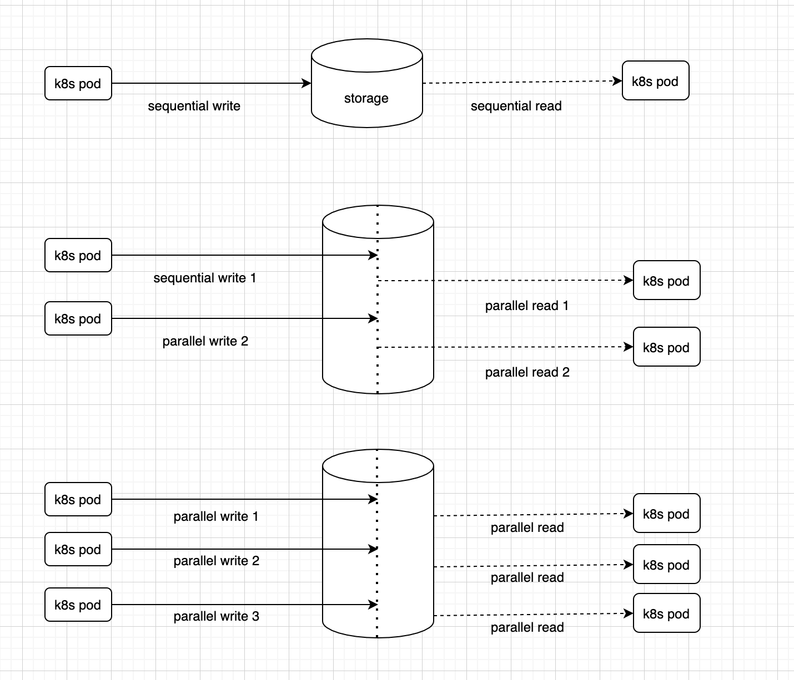

# Kubernetes Storage Readiness

Kubernetes has gained a lot of momentum with storage vendors and with new vendors providing support with [CSI](https://kubernetes-csi.github.io/docs/drivers.html) drivers,
it becomes essential for platform administrators to quickly validate new storages for their modernized workloads. 

This Ansible Playbook helps quickly validate a storage with basic tests on `ReadWriteOnce` and `ReadWriteMany` volumes for consistency and readiness. Note that these tests only covers the basics and are only meant to be a pre-cursor to a full blown test with your system workloads.



## Requirements

- Access to a Kubernetes cluster with permissions to create PVCs, ConfigMaps and run Jobs.
- A persistent storage class installed and configured to support `RWO` and `RWX` volumes.
- Ansible v2.10 or later

## Install Prerequisites

- Install Ansible using `pip`
  
   `pip install ansible`

- Install k8s modules

  `pip install openshift`
   
  `ansible-galaxy collection install operator_sdk.util`

- Ensure you are logged-in to your k8s cluster using `kubectl` or `oc`

## Setup Tests

- Update `params.yaml` file with your storage vendor and other details

  ```
  storageClass: "<storage vendor>" # Name of the storage class
  storageSize: "<storage volume size>"  # This test requires at least "5Gi" volume size to run tests.
  namespace: "readiness" # A new kubernetes namespace or project where you want to run the tests, this namespace should be existing with no existing resources deployed.
  ```

## Run Playbook


Execute the readiness tests by running the playbook

  ```
  ansible-playbook readiness-check.yaml --extra-vars "@./params.yml"
  ```

  You should see following message when all the tests pass

  ```
  ######################## MOUNT TESTS PASSED #################################

  ##################### SEQUENTIAL READ WRITE TEST PASSED #####################

  ################# SINGLE THREAD PARALLEL READ WRTIE TEST PASSED #############

  ################# MULTI NODE PARALLEL READ WRITE TEST PASSED ################
  ```

## Clean-up Resources

Delete the kuberbetes namespace that you created in [Setup](#setup)


